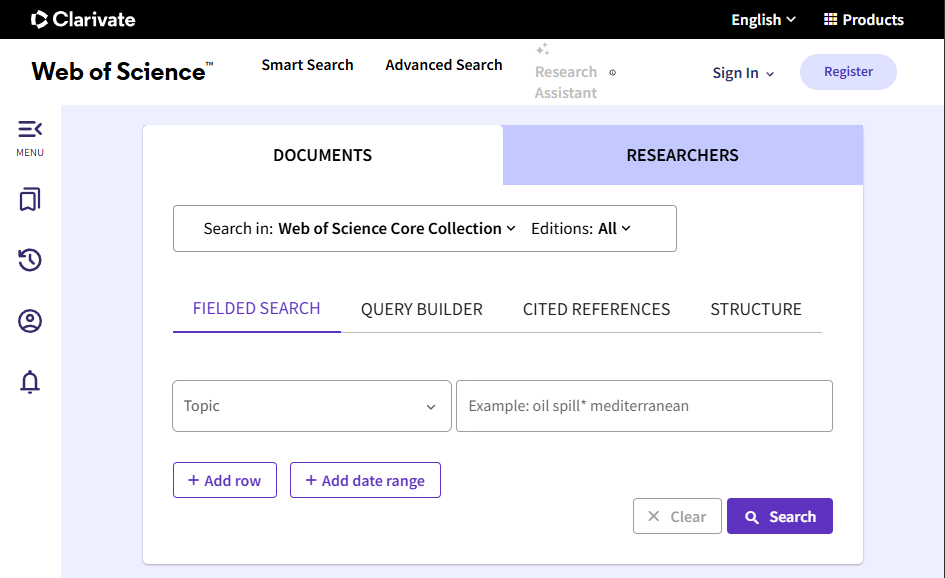
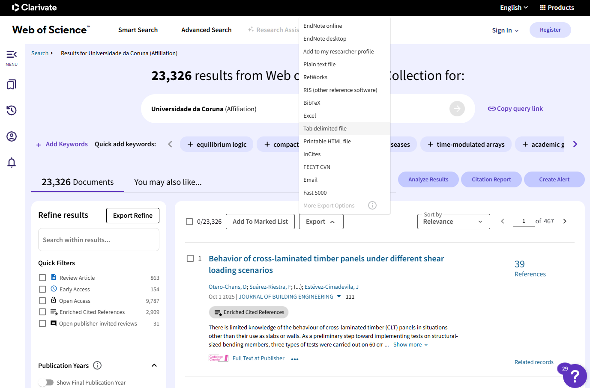
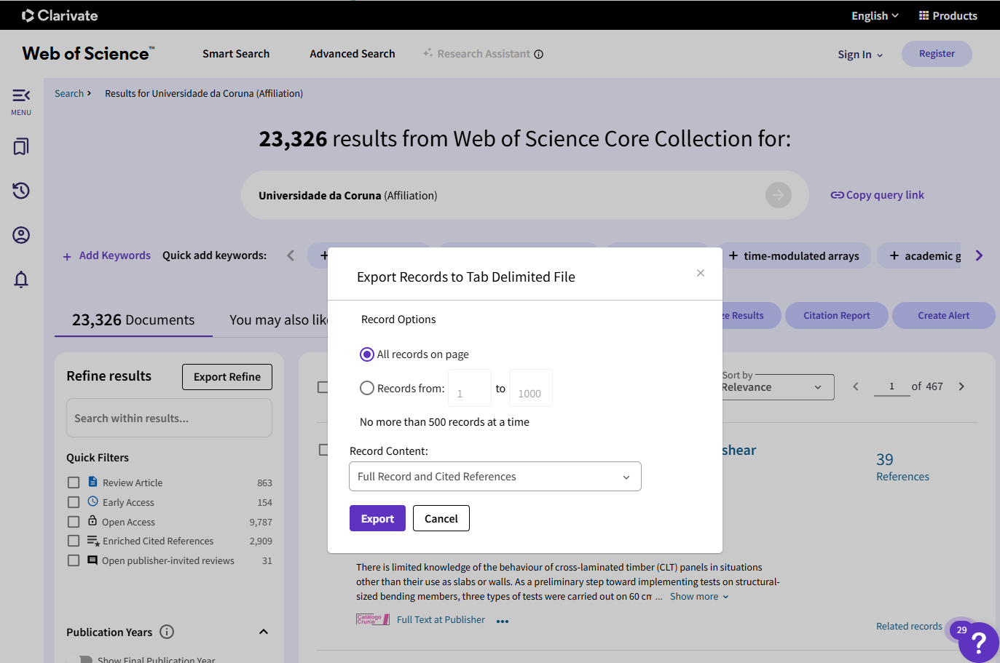

```{r setup, include=FALSE}
knitr::opts_chunk$set(echo = FALSE, fig.align = "center", out.width = "80%")
```

Note that **a subscription is required to import data from Web of Science**.


## Web of Science search web page

Access the Clarivate Web of Science (WoS) search web page: <https://www.webofscience.com/wos> 
(or through your institutional access link; for instance <https://www.recursoscientificos.fecyt.es> from the Spanish Foundation for Science and Technology, FECYT Consortium Academic Group).

Select the **Web of Science Core Collection** database in the top dropdown menu *Search in*, and choose the desired options:

-   **Editions**: this dropdown menu can be used to select the citation
    indexes (For example, following the [IUNE](https://iune.es/) criteria, 
    the first three could be select: *Science Citation Index Expanded*, 
    *Social Sciences Citation Index* and *Arts & Humanities Citation Index*).

-   **Add date range**: limit the results to a specific period.

-   **Add row:** include additional search criteria.

-   **Query Builder:** build more complex queries using field tags and
    Boolean operators.

      *Note:* Visit the online training portal for details: <https://clarivate.com/academia-government/training-support/>.

<br>

```{r echo=FALSE}
# {width="80%"}

```

<br>

Set the search fields and click on **Search**.

If you want to download the scientific output linked to a university, you can use the **Affiliation** field (**OG** in Advanced Search). 
You can search for the specific name as you start typing in the search field. 
The names of the universities that make up the Galician University System (SUG) are:

-   **UDC**: *Universidade da Coruna*.

-   **USC**: *Universidade de Santiago de Compostela*.

-   **UVIGO**: *Universidade de Vigo*.

Additionally, you can specify a **year range**.


## Download bibliometric data files

Once you obtain the results list, select **Export** and **Tab delimited file** (you will need to repeat this if the number of records exceeds 500, which is the default download limit).

<br>

```{r echo=FALSE}
# {width="80%"}

```

<br>

In the pop-up window, set the record range (considering the 500-record limit and that, in the last step, you will have to enter the exact total number of records in the upper limit), and make sure to select **Full Record and Cited References** in  the ***Record Content*** field.

<br>

```{r echo=FALSE}
# {width="80%"}

```

<br>

When you click **Export**, a text file (*savedrecs.txt* by default) containing the publication data will be downloaded. 
It is recommended to save these files in a subdirectory, renaming them appropriately.
