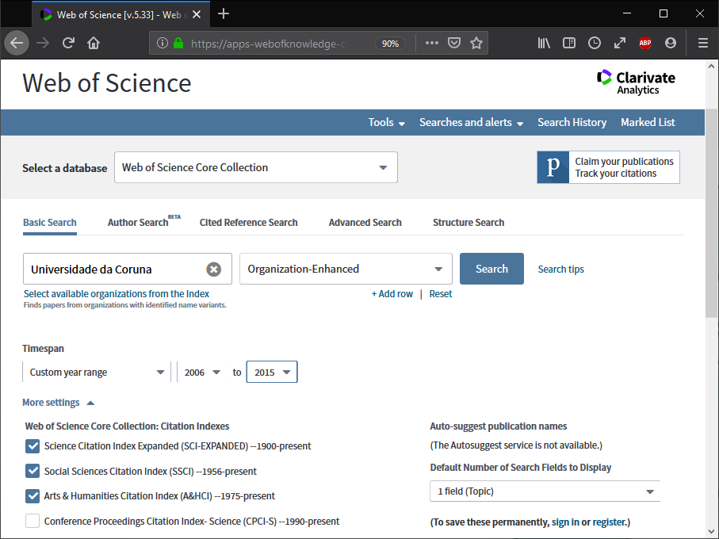
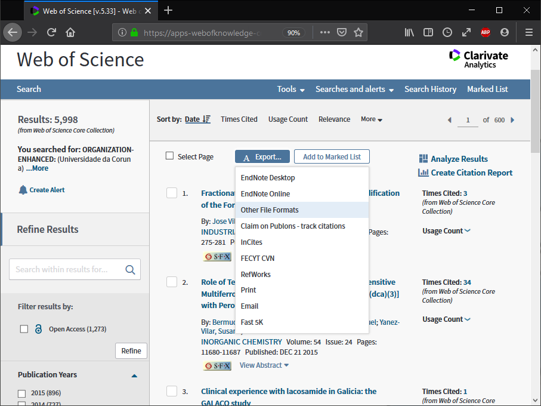
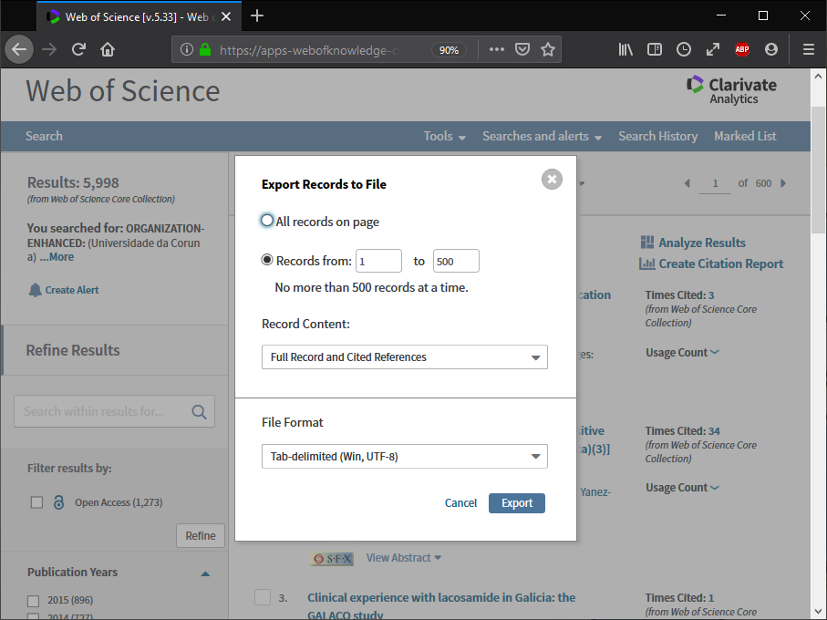

```{r setup, include=FALSE}
knitr::opts_chunk$set(comment=NA, fig.height=5, fig.width=7, fig.align = 'center', out.width="80%")
# chunk options: results='hold', fig.show = 'hold'

# https://github.com/r-lib/pkgdown/issues/1027
embed_png <- function(path, dpi = NULL) {
  meta <- attr(png::readPNG(path, native = TRUE, info = TRUE), "info")
  if (!is.null(dpi)) meta$dpi <- rep(dpi, 2)
  knitr::asis_output(paste0(
    ""
  ))
}
```

Acceder a la página web de búsqueda de *Clarivate Analytics Web of Science*
(WoS): [*http://www.webofknowledge.com*](http://www.webofknowledge.com), 
[*http://wos.fecyt.es*](http://wos.fecyt.es).

Seleccionar la base de datos *Web of Science Core Collection* (Colección
principal de WoS) en el desplegable superior, desplegar más ajustes
(*More settings*) y seleccionar únicamente los tres primeros índices de citas (si se sigue el criterio del [IUNE](http://www.iune.es)):

```{r echo=FALSE}
# {width="80%"}

```

<br>

Establecer los campos de búsqueda (básica o avanzada) y pulsar en
*Search*. 

Si se desea descargar la producción científica vinculada a una
universidad se puede emplear el campo *Organization-Enhaced* (*OG*,
Organización-Consolidada). Se puede buscar el nombre específico de la
universidad en *Select available organizations from the Index*, los de
las universidades que conforman el Sistema Universitario de Galicia
(SUG) son:

-   UDC: Universidade da Coruna

-   USC: University of Santiago De Compostela

-   UVI: University of Vigo

Adicionalmente se puede especificar un rango de años.

Una vez que se obtiene el listado de resultados, seleccionar *Export...* y
*Other File Formats* (habrá que hacer esto repetidamente si el
número de registros es superior a 500, el límite por defecto para la
descarga de archivos).


```{r echo=FALSE}
# {width="80%"}

```

<br>

En la ventana emergente establecer el rango de registros (teniendo en
cuenta el límite de 500 y que en el último paso habrá que poner el total
exacto de registros en el límite superior):


```{r echo=FALSE}
# {width="80%"}

```

<br>

Al pulsar en *Export* se descargará un archivo de texto (*savedrecs.txt*
por defecto) con los datos de las publicaciones. Sería recomendable
irlos guardando en un subdirectorio, renombrando los archivos
adecuadamente.
