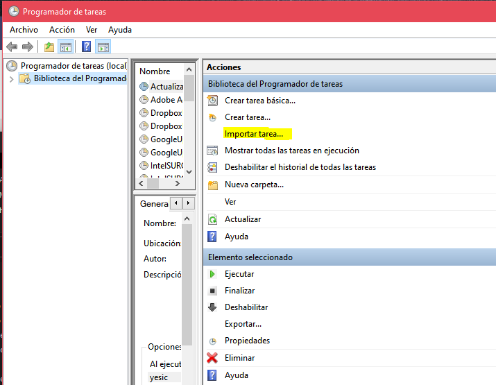

A continuación, se describen los pasos para la creación una base de datos empleando la [API de WoS](https://developer.clarivate.com/apis), así como para la planificación de las actualizaciones. 
Posteriormente se puede importar a R empleando la función `ImportDB.wos()` del paquete `scimetr`.
Para información adicional ver [Fernández-Ramos (2021)](https://ruc.udc.es/dspace/handle/2183/27771).


En primer lugar es necesario estar subscrito a la *Web of Science API Expanded* (disponer de nombre de usuario y contraseña). Hay que tener en cuenta que el acceso al sitio web no implica el acceso a la API, ya que Thomson Reuters los factura por separado. 


Repositorio
-----------

https://github.com/YesicaFdzr/bibliometrics

Software necesario
------------------

Para la creación del sistema de información, es necesario tener
instalado Python, concretamente, una versión igual o superior a la 3.6.
Importante que se encuentre en el path del sistema. Además, son
necesarias las siguientes librerías:

-   Pandas

-   xml.etree.ElementTree

-   sqlite3

-   re

-   datetime

Por otra parte, como la librería de WoS fue modificada en el proyecto,
es importante descargar la carpeta WoS del repositorio y copiarla en la
ruta donde se encuentra Python instalado, por ejemplo:
C:/Python3.6/Lib/site-packages/.

Además, se puede descargar [DB Browser for SQLite](https://sqlitebrowser.org/) para inspeccionar los datos de la BD.

Por último, se descargan los archivos del repositorio que se encuentran
en la carpeta *utils* y *actualizations*.


Utilización de los Scripts
--------------------------

Los scripts descargados pueden ejecutarse por separado. 
Es importante saber que para ejecutar aquellos que incorporan datos al modelo, es necesario contar con una base de datos creada. 
Para ello, existe un script, *Creación\_bd.py*, al que sólo tenemos que pasarle el nombre que queremos ponerle al sistema de información y, si no queremos que la cree en la ruta actual del archivo, la ruta de creación. 
Se muestran los dos ejemplos en la siguiente figura.


```{r echo=FALSE}
# 
knitr::include_graphics("wos_bd1.png")
```


Para ejecutar los demás scripts el procedimiento es el mismo, cambiando
los parámetros. 
La lista de parámetros necesarios para cada archivo se muestra en la siguiente tabla.

  **Archivo**            **Parámetros**
  ---------------------- ---------------------------------------------------------------------
  Dascarga\_datos.py     \"user \"password\" \"bd\" \"query\" \"symbolicTimespan\"(optional)
  Actualizar\_citas.py   \"user\" \"password\" \"bd\" \"query\"
  Importar\_JCR.py       \"archivo\_jcr.xlsx\" \"bd\"


Creación de las Actualizaciones
-------------------------------

Para la creación de las actualizaciones únicamente es necesario cambiar
las rutas en los archivos BAT. 

Adicionalmente, se pueden añadir en el programador de tareas de Windows las tareas necesarias. 
Para ello, en el repositorio existen tres archivos XML que se pueden importar directamente en el programador (ver figura siguiente). 
Una vez importados, sólo tendremos que cambiar la ruta del archivo BAT y los campos que creamos convenientes. 
Para más detalles ver Sección 4.7 de Fernández-Ramos (2021).


```{r echo=FALSE}
# 

```


Referencias
-----------

Bacis, Enrico (2019). [wos: Web of Science client using API v3](https://pypi.org/project/wos/). Python package version 0.2.5. <https://github.com/enricobacis/wos>.

Fernández-Ramos, Yésica (2021). [Análisis y Diseño de un Sistema de Información Bibliométrico de Publicaciones Científicas](https://ruc.udc.es/dspace/handle/2183/27771). Trabajo de fin de Grado en Ingeniería Informática. 


